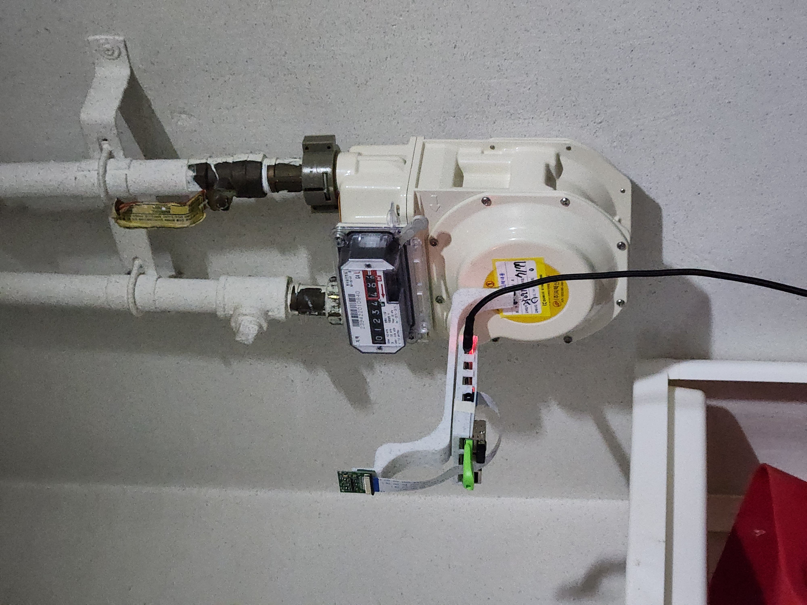
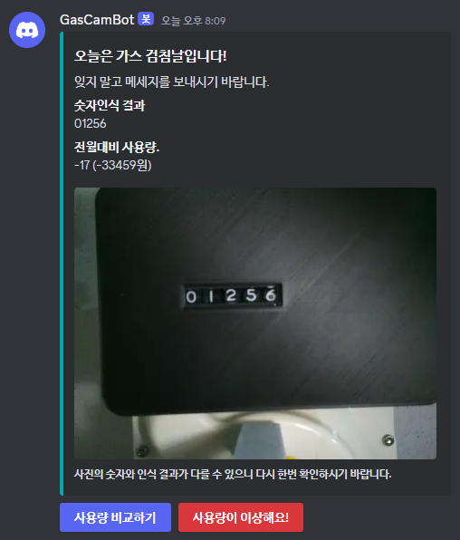
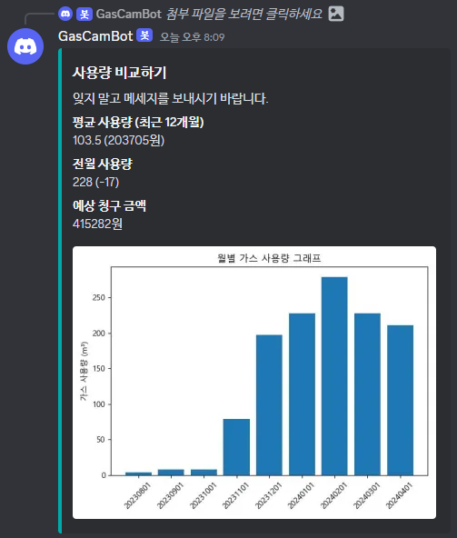

# OCR을 활용한 자동 가스 검침기
매월 1일마다 가스 계량기의 사용량을 측정해 디스코드로 알림을 준다.

    

 

## 사용방법
매월 1일 오후 1시 마다 자동으로 측정하며 <code>/수동측정</code>을 통해 수동으로 측정할수 있다.  
만약 측정값이 잘못되었다면 <code>/직접입력</code>을 통해 값을 수정할수 있다.  
또한 <code>사용량 비교하기</code>버튼을 눌러 최근 12월간의 사용량 그래프와 평균 사용량, 전월대비 사용량, 예상 청구 금액을 알아볼수 있다.

 

## 사용예시

    

    

